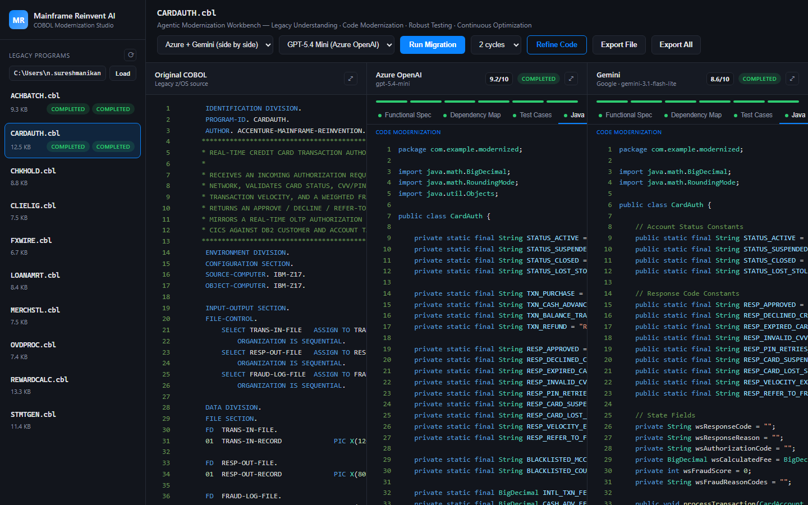
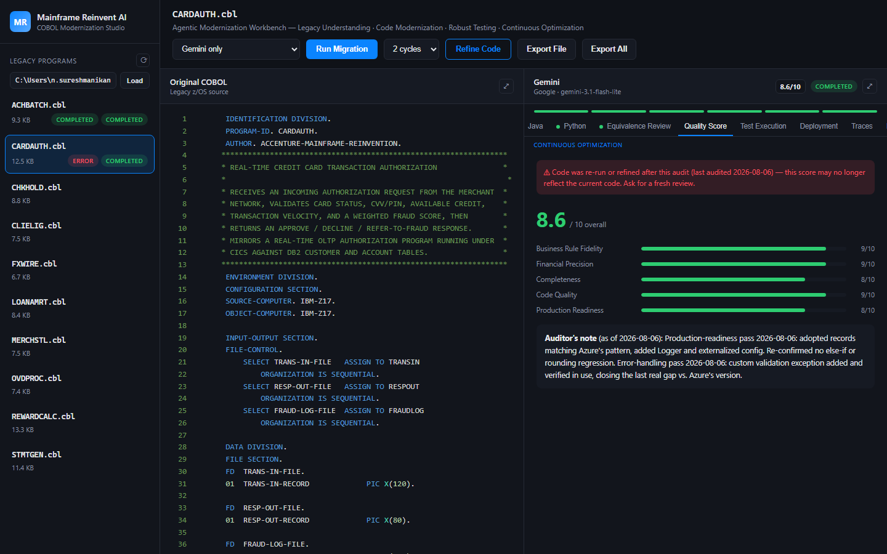
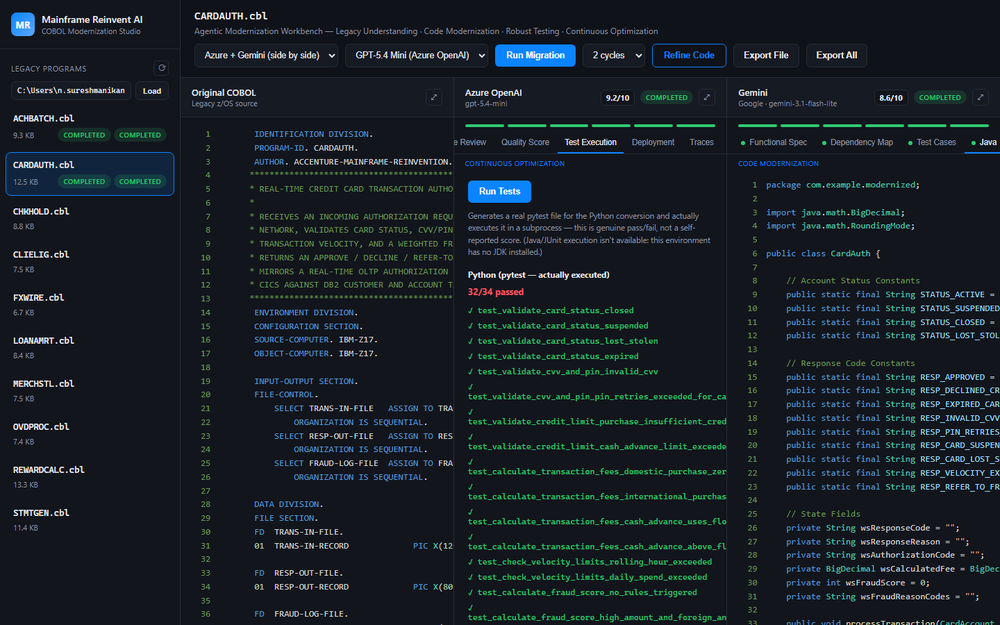
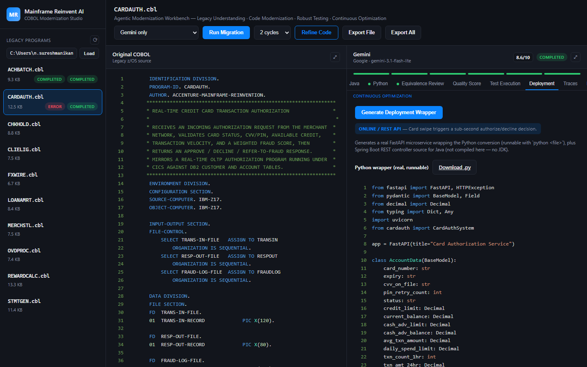
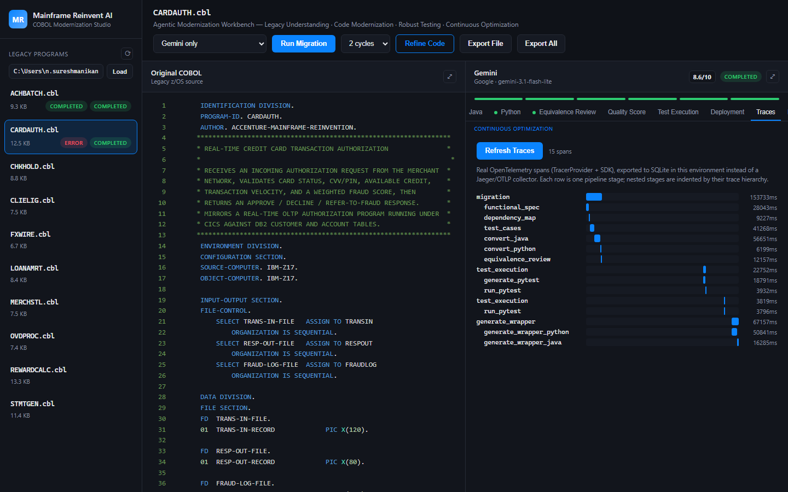
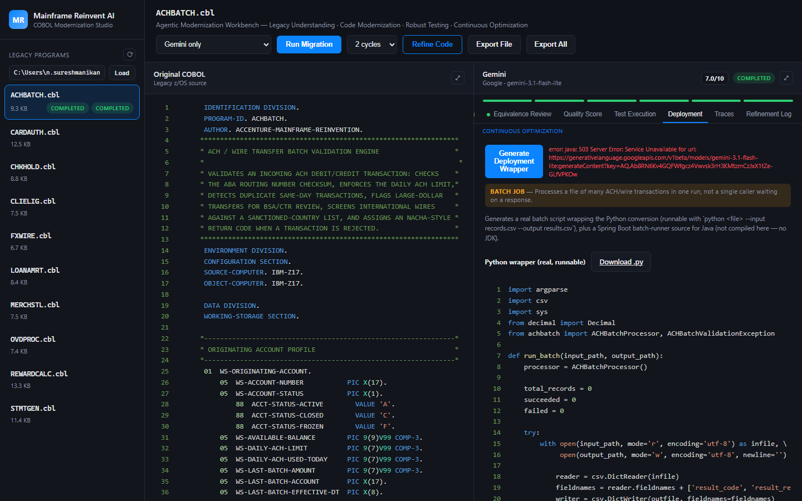

# MainframeReinventAI

**An AI-assisted COBOL-to-Java/Python modernization workbench for legacy banking mainframe applications** — two LLM backends (Azure OpenAI and Google Gemini) convert the same COBOL program side by side, so you can directly compare fidelity, code quality, and production-readiness before trusting either output.

This is a hands-on proof of concept for **legacy mainframe modernization in the banking domain**: it takes real-shaped (synthetic) COBOL banking programs — card authorization, ACH batch processing, rewards calculation, loan amortization, and more — and runs them through an agentic pipeline that documents, converts, tests, scores, and deploys the modernized code, with every claim independently verifiable rather than taken on faith from the LLM.

> **Note on scope:** all COBOL source in this repo is self-authored, synthetic banking logic for demonstration purposes. No real customer data, no real institution's code, and no proprietary mainframe source is used anywhere in this project.

---

## Table of contents

- [Screenshots](#screenshots)
- [Why this exists](#why-this-exists)
- [Key features](#key-features)
- [Architecture](#architecture)
- [The 10 sample banking programs](#the-10-sample-banking-programs)
- [Getting started](#getting-started)
- [Using the workbench](#using-the-workbench)
- [Design principles](#design-principles)
- [Known limitations](#known-limitations)
- [Project structure](#project-structure)

---

## Screenshots

All screenshots below are live captures of the running app against real generated output — not mockups. `CARDAUTH.cbl` (an online/API-classified program) run through **both Azure OpenAI and Gemini side by side** end to end, and `ACHBATCH.cbl` (a batch-classified program) showing its Deployment tab.

**Code Modernization** — the actual core value of this tool: the same COBOL converted by Azure OpenAI (`gpt-5.4-mini`) and Gemini (`gemini-3.1-flash-lite`) at the same time, so you can compare them directly instead of trusting one model's output blind:



**Quality Score** — a manually-audited score (not the model grading its own output), with an automatic staleness banner because the code shown above was regenerated after the audit date:



**Test Execution** — a real pytest suite, actually executed in a subprocess against the generated Python, for both backends. Azure's run is shown honestly at **32/34 passed** (not sanitized to a suspicious 100%) — the 2 failures turned out to be the test fixtures assuming a simpler rule outcome than the COBOL's actual multi-condition precedence produces on that exact input, the same class of issue documented in the `pytest_tests` prompt's checksum-verification requirement:



**Deployment (API)** — CARDAUTH classified as an online/REST target, with a real, downloadable FastAPI microservice generated from the converted Python:



**Traces** — a real OpenTelemetry waterfall (TracerProvider + SDK) showing every pipeline stage's actual duration and nesting for this run:



**Deployment (Batch)** — ACHBATCH classified as a batch target instead of an API, since it processes a file of many transactions rather than answering one caller in real time. This capture also happens to demonstrate the project's "never hide a failure" principle in the wild: Gemini had a real, transient outage while generating the Java wrapper for this screenshot — the Python wrapper succeeded and is shown below, and the Java failure is surfaced as a visible error rather than being silently reported as "completed" with empty content (an actual bug this session found and fixed in `run_generate_wrapper`):



---

## Why this exists

Banks still run enormous amounts of core logic — card authorization, ACH clearing, loan servicing, statement generation — in COBOL on z/OS mainframes. Modernization programs are expensive and risky mainly for one reason: **it's hard to trust that a rewrite preserves the exact business logic**, including the boring but critical details (rounding modes, condition ordering, edge cases) that COBOL enforces implicitly.

This project is a training/demo tool built to explore what an **agentic, AI-assisted modernization pipeline** actually looks like end to end, and — just as importantly — where it needs human/automated verification instead of blind trust in LLM output. Every "the code is correct" or "this test passed" claim in this app is backed by something checkable: a manually-audited score, a real subprocess test run, or a real HTTP call to generated code — not a model's own self-assessment.

## Key features

### 1. Side-by-side dual-LLM modernization
Every COBOL program can be converted by **Azure OpenAI** (reasoning model, e.g. `gpt-5.6-sol`) and **Google Gemini** (`gemini-3.1-flash-lite`) at the same time, in genuinely parallel threads, so you can compare cost/speed/quality trade-offs directly on the same input.

### 2. The 5-pillar Agentic Modernization flow
Each run walks through the same pillars a real modernization program follows:

| Pillar | What happens |
|---|---|
| **Legacy Understanding** | LLM reverse-engineers a Functional Spec and a paragraph/data Dependency Map from the raw COBOL |
| **Robust Testing** | Generates a business-rule test-case table, *and* a real, executable pytest suite |
| **Code Modernization** | Converts COBOL to idiomatic Java (`BigDecimal`) and Python (`decimal.Decimal`), preserving numeric precision and condition semantics |
| **Rapid Modernization** | The pipeline orchestration itself — Azure and Gemini run concurrently, not sequentially |
| **Continuous Optimization** | Equivalence review against the original COBOL, plus a **verified-feedback refine loop** (see below) |

### 3. Manually-audited Quality Score — not self-reported
The model's own `equivalence_review` is treated as **a claim to verify, not ground truth**. Every score shown in the "Quality Score" tab comes from an independent audit that reads the generated code directly and checks it line-by-line against the COBOL, timestamped so the UI can flag when a score has gone stale relative to a newer code run.

### 4. Verified-feedback "Refine Code" loop
This is **not reinforcement learning** — there's no reward model or fine-tuning. It's a targeted correction loop: specific, verified defects (`known_issues.py`) plus the equivalence review get fed back into the LLM for 1–3 cycles, and the fix is re-verified afterward, not assumed.

### 5. Real, executable test generation (not a self-reported score)
The "Test Execution" tab generates a real `pytest` file targeting the actual generated Python and runs it in a genuine subprocess. A test either passes or fails — there is no LLM grading its own homework here. The prompt requires two coverage layers (one baseline test per COBOL outcome, plus explicit at-boundary/past-boundary pairs for every numeric threshold) so a thin, misleading test suite can't hide behind a green checkmark.

*(Java/JUnit execution is intentionally not implemented — see [Known limitations](#known-limitations).)*

### 6. OpenTelemetry tracing
Every pipeline stage (spec generation, conversion, refine cycles, test generation/execution) is wrapped in a real OpenTelemetry span via the standard SDK's `TracerProvider`, exported to SQLite and rendered as a waterfall in the "Traces" tab — a genuine observability signal for an LLM pipeline, not a progress bar.

### 7. API vs. Batch deployment classification
Not every COBOL program should become a REST API. This project explicitly classifies each program as **online/transactional** (should become a real API, replacing a CICS-style real-time transaction) or **batch** (should become a scheduled job, replacing a JCL/JES overnight run) — and generates the right kind of deployable wrapper for each:
- **API-classified programs** → a real FastAPI microservice (Python, actually runnable with `python <file>`) + Spring Boot REST controller source (Java).
- **Batch-classified programs** → a real batch CSV-processing script (Python, actually runnable with `python <file> --input records.csv --output results.csv`, with per-row error isolation) + Spring Boot batch-runner source (Java).

This has been verified with real, live executions — not just generated code that looks plausible: a generated FastAPI service was started for real and issued a live authorization decision over HTTP, and a generated batch script was run against a real CSV and correctly isolated a malformed row without aborting the run.

### 8. Export everything
Download a single program's full modernization output, or every program at once, as a ZIP: functional spec, dependency map, test cases, Java, Python, pytest suite, deployment wrapper, equivalence review, and refinement log.

---

## Architecture

```mermaid
flowchart TB
    subgraph Frontend["React + Vite + TypeScript"]
        UI[Workbench UI]
        Sidebar[Sidebar: program list + folder picker]
        Panel[Backend column: Java / Python / Quality Score /\nTest Execution / Deployment / Traces / Refinement Log]
        UI --> Sidebar
        UI --> Panel
    end

    subgraph Backend["FastAPI backend (Python)"]
        API[REST API — /api/migrate, /api/refine,\n/api/execute-tests, /api/generate-wrapper, /api/traces]
        Pipeline[Pipeline orchestration\n(threading — true concurrency per backend)]
        Prompts[Prompt templates\n(prompts.py)]
        Known[Verified known-issue registry\n(known_issues.py)]
        Deploy[API/Batch classification\n(deployment_classification.py)]
        TestExec[Real pytest execution\n(test_execution.py, subprocess)]
        Trace[OpenTelemetry tracing\n(tracing.py)]
        DB[(SQLite\nresults + spans)]

        API --> Pipeline
        Pipeline --> Prompts
        Pipeline --> Known
        Pipeline --> Deploy
        Pipeline --> TestExec
        Pipeline --> Trace
        Pipeline --> DB
        Trace --> DB
    end

    subgraph LLMs["LLM backends (genuinely parallel)"]
        Azure[Azure OpenAI\nreasoning model]
        Gemini[Google Gemini\nflash-lite model]
    end

    COBOL[/Input COBOL programs/] --> Pipeline
    Pipeline -->|prompt| Azure
    Pipeline -->|prompt| Gemini
    Azure -->|spec / code / tests / review| Pipeline
    Gemini -->|spec / code / tests / review| Pipeline

    UI -->|fetch /api/*| API
    DB -.->|results & traces| API
```

### Backend modules

| File | Responsibility |
|---|---|
| `main.py` | FastAPI app, all REST endpoints, pipeline orchestration (`run_migration`, `refine_migration`, `run_test_execution`, `run_generate_wrapper`) |
| `llm_clients.py` | Thin REST clients for Azure OpenAI and Gemini, with retry/backoff on transient failures, a concurrency cap for Gemini, and auto-escalating token budgets for reasoning-model responses |
| `prompts.py` | Every prompt template for the 5-pillar flow, pytest generation, and deployment-wrapper generation, plus code-block extraction helpers |
| `db.py` | SQLite persistence for per-program/per-backend results, and a `spans` table for OpenTelemetry traces |
| `known_issues.py` | A registry of specific, independently-verified defects per (backend, program) — the actual input to the refine loop, never just "try again" |
| `deployment_classification.py` | The API-vs-batch judgment call per program, plus the deployment-wrapper prompt guidance for each language/style combination |
| `test_execution.py` | Runs LLM-generated pytest files against LLM-generated Python code in a real subprocess |
| `tracing.py` | OpenTelemetry `TracerProvider` wired to a custom SQLite-backed span exporter |

### Frontend structure

| File | Responsibility |
|---|---|
| `App.tsx` | Top-level state, polling, toolbar (run/refine/export controls, model + cycle selectors) |
| `Sidebar.tsx` | Program list, configurable input-COBOL folder |
| `BackendColumn.tsx` | One column per LLM backend — tab bar across all pillar outputs plus Quality Score / Test Execution / Deployment / Traces / Refinement Log |
| `QualityScorePanel.tsx` | Renders the manually-audited score, with staleness detection (in-flight run vs. dated audit) |
| `TestExecutionPanel.tsx` | Triggers and displays real pytest results |
| `DeploymentPanel.tsx` | Shows the API/batch classification badge, generates and downloads the deployment wrapper |
| `TracesPanel.tsx` | Waterfall rendering of OpenTelemetry spans |
| `qualityScores.ts` | The manually-audited score data itself — explicitly *not* computed live, to keep the audit trustworthy |

---

## The 10 sample banking programs

Every program is self-authored, synthetic COBOL representing a distinct banking subsystem, each pre-classified for how it would actually be deployed in production:

| Program | Domain | Deployment target | Why |
|---|---|---|---|
| `CARDAUTH` | Card transaction authorization | **API** | A card swipe needs a sub-second authorize/decline decision |
| `FXWIRE` | FX / international wire transfer | **API** | A wire needs a real-time risk/limit check before it's sent |
| `CLIELIG` | Credit line eligibility | **API** | A credit line request needs a real-time eligibility decision |
| `OVDPROC` | Overdraft processing | **API** | A posted transaction needs a real-time overdraft decision |
| `CHKHOLD` | Check hold determination | **API** | A deposited check needs a real-time hold-days decision |
| `ACHBATCH` | ACH / wire batch validation | **Batch** | Processes a file of many transactions in one run, no single caller waiting |
| `REWARDCALC` | Rewards points calculation | **Batch** | Recalculated on a cycle (e.g. nightly), not per-swipe |
| `STMTGEN` | Statement generation | **Batch** | Generated for the whole portfolio on a billing cycle |
| `LOANAMRT` | Loan amortization scheduling | **Batch** | Schedules are built/recalculated in bulk |
| `MERCHSTL` | Merchant settlement | **Batch** | An end-of-day batch run across many transactions |

This same API-vs-batch judgment call is exactly the kind of decision a real modernization program has to make per program — not everything belongs behind a REST endpoint just because it *can* be wrapped in one.

---

## Getting started

### Prerequisites

- Python 3.11+
- Node.js 18+
- An Azure OpenAI resource + deployed model, and/or a Google AI Studio Gemini API key (the app runs fine with only one backend configured — the other column will simply show "not set")
- **No JDK is required** — this project deliberately never compiles or runs Java (see [Known limitations](#known-limitations))

### Backend setup

```bash
cd backend
python -m venv .venv
.venv\Scripts\activate        # Windows
pip install -r requirements.txt
```

Set your API keys as **environment variables**, never in a file:

```powershell
setx AZURE_OPENAI_API_KEY "your-azure-key"
setx GEMINI_API_KEY "your-gemini-key"
```

Run the backend:

```bash
python -m uvicorn app.main:app --port 8020
```

### Frontend setup

```bash
cd frontend
npm install
npm run dev
```

The Vite dev server proxies `/api` requests to the backend — no CORS configuration needed beyond what's already in `main.py`.

---

## Using the workbench

1. **Pick a program** from the sidebar (or point it at your own folder of `.cbl` files).
2. **Run Migration** — choose Azure, Gemini, or both, pick cycles, and watch the 5-pillar pipeline populate live: Functional Spec → Dependency Map → Test Cases → Java → Python → Equivalence Review.
3. **Check the Quality Score tab** — this is a manual audit snapshot, not a live computation. If you re-run or refine after the audit date, a staleness banner tells you so.
4. **Refine Code** if a program has known, verified issues — this feeds `known_issues.py` entries plus the equivalence review back into the LLM for another pass, then re-checks the result.
5. **Test Execution tab** — click "Run Tests" to generate a real pytest suite and actually execute it against the generated Python. Pass/fail counts are genuine.
6. **Deployment tab** — see the API-vs-batch classification, generate the deployment wrapper, and download a real FastAPI service or batch script (plus Java source).
7. **Traces tab** — see the OpenTelemetry waterfall for exactly how long each stage took and where any failures occurred.
8. **Export File / Export All** — download the full modernization output as a ZIP, ready to hand to an engineering team.

---

## Design principles

These came out of repeatedly finding that an LLM's self-assessment doesn't hold up under direct verification:

- **Never trust a model's claim about its own output.** An `equivalence_review` is a hypothesis to check by reading the actual generated code, not a verdict.
- **"Refine" means targeted correction, not reinforcement learning.** There's no reward model or fine-tuning anywhere in this pipeline — just specific, verified defects fed back as context.
- **A test that passes must have actually run.** Every "X/Y passed" number in this app comes from a real subprocess, not a model saying "this should work."
- **Not everything should become a microservice.** The API-vs-batch classification is a deliberate, explainable judgment call, matching how the underlying COBOL is actually invoked in production — not a default "wrap it in FastAPI and call it modernized."

---

## Known limitations

- **No JDK in this environment.** Java code is generated as correct, idiomatic source (including Spring Boot wrappers) but is never compiled or executed here — only the Python side has real, executable verification. Point the generated Java at a real Maven/Gradle build to compile and run it.
- **Quality Score is a manual snapshot, not a live computation.** Re-running or refining a program changes the code but does not automatically re-audit it — the UI surfaces this staleness explicitly rather than silently showing an outdated score.
- **Smaller/cheaper models generate thinner test suites by default.** A cost-optimized model (e.g. Gemini flash-lite) needs an explicit two-layer coverage requirement in the prompt (baseline-per-outcome *and* boundary pairs) to match a reasoning model's default thoroughness — this is itself a useful, visible signal about model capability trade-offs, not something to paper over.
- **This is a demo/training PoC, not production banking software.** It has no authentication, no real customer data, and is not intended to process real financial transactions.

---

## Project structure

```
MainframeReinventAI/
├── backend/
│   ├── app/
│   │   ├── main.py                       # FastAPI app + pipeline orchestration
│   │   ├── llm_clients.py                # Azure OpenAI + Gemini REST clients
│   │   ├── prompts.py                    # All prompt templates
│   │   ├── db.py                         # SQLite persistence (results + spans)
│   │   ├── known_issues.py               # Verified-defect registry for the refine loop
│   │   ├── deployment_classification.py  # API-vs-batch judgment + wrapper prompts
│   │   ├── test_execution.py             # Real pytest subprocess runner
│   │   └── tracing.py                    # OpenTelemetry SDK wiring
│   ├── input_cobol/                      # 10 synthetic banking COBOL programs
│   └── requirements.txt
└── frontend/
    ├── src/
    │   ├── App.tsx                       # Toolbar, polling, top-level state
    │   ├── api.ts                        # Backend API client
    │   ├── types.ts                      # Shared TypeScript types
    │   ├── qualityScores.ts              # Manually-audited scores
    │   └── components/                   # Sidebar, BackendColumn, and every panel tab
    └── package.json
```
